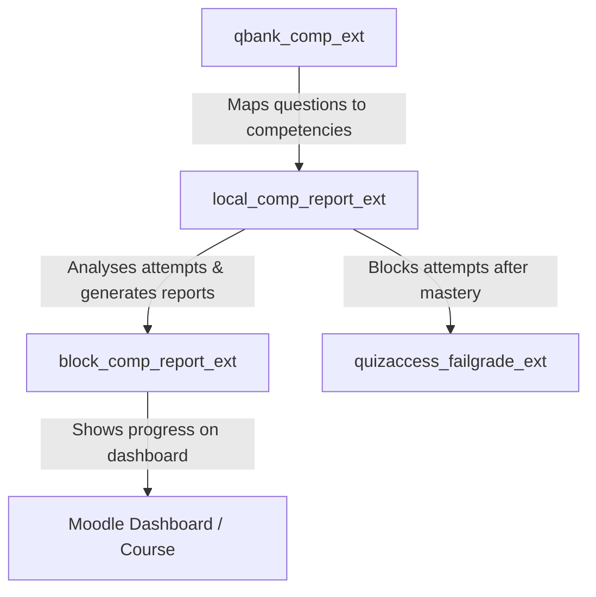

# 📦 Moodle Block Plugin: Competency Report Overview (`block_comp_report_ext`)

[](https://moodle.org)
[](https://php.net)
[](https://docs.moodle.org)
[](http://www.gnu.org/copyleft/gpl.html)
[](https://github.com/engfeda-ui/moodle-block_competency_report)

A professional Moodle Dashboard Block plugin that provides students with a clean, high-impact summary of their competency achievements. Placed on the Moodle Dashboard or course sidebar, this widget shows total proficiencies achieved with a visual progress bar and provides one-click access to full competency analysis reports.

---

## ✨ Features

- **Dashboard-Level Summary:** Shows the student's total proficient competencies site-wide with a colour-coded progress bar (green / yellow / red based on percentage).
- **Dynamic Context-Aware Display:**
  - **On Dashboard:** Aggregates all competencies across all courses with a progress bar showing `X / Y` proficient.
  - **On Course Page:** Shows a direct link to the student's individual competency report for that specific course.
- **Mustache Template Rendering (NEW in v1.1.0):** Block content is now rendered via a Mustache template (`templates/block_content.mustache`), making it fully customisable by Moodle themes without touching PHP.
- **Colour-Coded Progress Bar (NEW in v1.1.0):** Visual progress bar with three states — green (≥80%), yellow (≥50%), red (<50%).
- **Capability Definitions (NEW in v1.1.0):** `db/access.php` now defines `addinstance` and `myaddinstance` capabilities, giving administrators fine-grained control over who can add the block.
- **Privacy Provider (NEW in v1.1.0):** `classes/privacy/provider.php` formally declares that this block stores no personal data of its own.
- **Localization Support:** English language strings included.

---

## 📋 Requirements & Dependencies

| Dependency | Required Version / Compatibility |
| :--- | :--- |
| **Moodle Framework** | Moodle 4.5 to 5.0+ |
| **PHP Runtime** | PHP 8.1, PHP 8.2, PHP 8.3 |
| **Database System** | PostgreSQL 13+, MySQL 8.0+, or MariaDB 10.5+ |
| **Required Plugin** | [**`local_comp_report_ext`**](https://github.com/engfeda-ui/competency-report) ≥ 2026052500 |

---

## 🚀 Installation

1. **Prerequisite:** Install [**`local_comp_report_ext`**](https://github.com/engfeda-ui/competency-report) first.
2. **Download & Extract:** Download the repository and extract the files.
3. **Directory Placement:** Copy the `block_comp_report_ext` folder into your Moodle `blocks/` directory:
   ```
   moodle/blocks/comp_report_ext
   ```
   > The directory name inside `blocks/` must be exactly `competency_report`.
4. **Run Moodle Upgrade:** Log in as Administrator and navigate to **Site administration > Notifications**.
5. **Alternative Install:** Zip the directory and upload via **Site administration > Plugins > Install plugins**.

---

## 🛠️ Usage & Configuration

### Placing on the Student Dashboard
1. Go to the **Dashboard** and enable **Edit mode**.
2. Open the block drawer and click **Add a block**.
3. Select **Competency Report Overview**.
4. The block shows each student their proficiency count and progress bar across all courses.

### Placing on a Course Page
1. Go to the desired **Course** and enable **Edit mode**.
2. Open the block drawer and click **Add a block**.
3. Choose **Competency Report Overview**.
4. The block shows a **"View Full Report Card"** button linking to the course-specific competency report.

---

## 📋 Changelog

### v1.4.3 (2026082401) — 2026-08-24
- **CI/CD:** Streamlined deployment pipeline directly to Production environment and removed deprecated staging branch/configuration.

### v1.4.2 (2026082400) — 2026-08-24
- **Maintenance:** Added standard `.gitignore` and updated `.gitattributes` for complete LF line endings across all template/asset types.
- **Security:** Excluded local agent instruction files from git tracking.
- **CI/CD:** Enhanced dual-environment deployment workflow with flexible staging host configuration.

### v1.4.1 (2026072701) — 2026-07-27
- **CodeSniffer Compliance:** Resolved PHPCS Moodle CodeSniffer warnings and errors in `classes/privacy/provider.php` (removed redundant `MOODLE_INTERNAL` check and fixed class opening brace spacing).

### v1.4.0 (2026072700) — 2026-07-27
- **Privacy API Fix:** Updated `classes/privacy/provider.php` to implement `\core_privacy\local\metadata\null_provider` returning language string key `privacy:metadata`.
- **Packaging:** Standardized ZIP package directory structure to `comp_report_ext/` using standard forward slashes (`/`) for Moodle Directory validation.
- **Repository Naming Note:** Recommended official repository naming convention is `moodle-block_comp_report_ext`.

### v1.3.1 — 2026-07-26
- **Fix & Compliance:** Added official GNU General Public License v3 (`LICENSE`) file to root of plugin package for Moodle Marketplace compliance.

### v1.3.0 — 2026-07-24
- **Release:** Standardized frankenstyle component name to `block_comp_report_ext` installed under `blocks/comp_report_ext`. Updated dependency requirement to `local_comp_report_ext` >= `2026072401`.

### v1.2.0 — 2026-05-25
- **Refactor:** Verified and optimized Mustache templates to use native Bootstrap classes for maximum layout and theme compatibility with Moodle 4.5+ and 5.0+ Boost themes.
- **Dependency Sync:** Updated `local_comp_report_ext` dependency to version `2026052500` to support the latest local LLM reporting upgrades.

### v1.1.0 — 2026-05-19
- **New:** Mustache template (`templates/block_content.mustache`) — HTML is no longer built via PHP string concatenation.
- **New:** Colour-coded progress bar on the dashboard view (green / yellow / red).
- **New:** `db/access.php` — defines `addinstance` and `myaddinstance` capabilities.
- **New:** `classes/privacy/provider.php` — GDPR privacy provider formally declaring no personal data is stored.
- **New:** Additional language strings: `totalproficient_label`, `nodata`, capability strings, privacy strings.
- **Refactor:** `get_content()` split into `render_dashboard_view()` and `render_course_view()` helper methods for clarity.

### v1.0.1 — 2026-05-19
- Initial stable release.

---

## 💻 Directory Structure

```
block_comp_report_ext/
├── classes/
│   └── privacy/
│       └── provider.php    # GDPR Privacy provider
├── db/
│   └── access.php          # Capability definitions
├── lang/
│   └── en/                 # English language strings
├── templates/
│   └── block_content.mustache  # Mustache template for block HTML
├── block_comp_report_ext.php # Main block class
├── version.php             # Plugin version and metadata
└── README.md
```

---

## 🔗 The Competency Ecosystem

This block is the user-facing widget of a 4-plugin competency-based education suite:



---

## 🔒 Security & Code Compliance

- **SQL Injection Prevention:** All queries use Moodle's `$DB` API with named parameter bindings.
- **Input Sanitization:** All input retrieved via `required_param()` / `optional_param()` with strict type filters.
- **Capability Controls:** `db/access.php` defines granular capabilities for block placement.
- **Privacy Compliance:** `privacy/provider.php` formally declares the plugin's data footprint.
- **Coding Standards:** Compliant with Moodle's `PHP_CodeSniffer` (PHPCS) ruleset.

---

## 📄 License & Credits

- **Copyright:** © 2026 Mahmoud Salem
- **License:** [GNU GPL v3](http://www.gnu.org/copyleft/gpl.html) or later.
