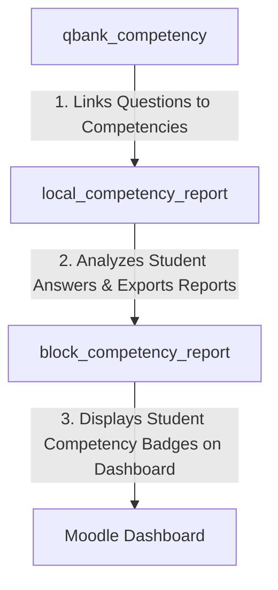

# 📦 Moodle Block Plugin: Competency Report Overview (`block_competency_report`)

[](https://moodle.org)
[](https://php.net)
[](https://docs.moodle.org)
[](http://www.gnu.org/copyleft/gpl.html)

A professional Moodle Dashboard Block plugin that provides students with a clean, high-impact summary of their competency achievements. Placed directly on the Moodle Dashboard or course sidebar, this widget acts as a motivational badge center, showing total proficiencies achieved and providing direct, one-click access to full-page competency analysis reports.

---

## ✨ Features

- **Dashboard-Level Summary:** Instantly showcases the total count of completed and mastered competencies to the student upon logging in.
- **Dynamic Context-Aware Links:** 
  - **On Dashboard:** Aggregates and links to a site-wide competency performance overview.
  - **On Course Page:** Directly context-links to the student's individual competency report for that specific course.
- **Aesthetic Visual Badging:** Renders high-quality visual cues aligned with modern Moodle design standards.
- **Enterprise Standards:**
  - Standard Moodle localization support with translation packs for English (`en`) and Turkish (`tr`).
  - Seamless backup & restore pipeline integration.

---

## 📋 Requirements & Dependencies

| Dependency | Required Version / Compatibility |
| :--- | :--- |
| **Moodle Framework** | Moodle 4.5 to 5.0+ (Tested against Moodle 4.5/5.0+ stable branches) |
| **PHP Runtime** | PHP 8.1, PHP 8.2, PHP 8.3 |
| **Database System** | PostgreSQL 13+, MySQL 8.0+, or MariaDB 10.5+ |
| **Required Plugin** | [**`local_competency_report`**](https://github.com/engfeda-ui/moodle-local_competency_report) (Must be installed and configured) |

---

## 🚀 Installation

Follow these steps to install the plugin manually:

1. **Prerequisite:** Ensure that you have already installed the [**`local_competency_report`**](https://github.com/engfeda-ui/moodle-local_competency_report) plugin.
2. **Download & Extract:** Download the repository and extract the files.
3. **Directory Placement:** Copy the `block_competency_report` folder into your Moodle installation's blocks directory:
   ```bash
   moodle/blocks/competency_report
   ```
   *Note: Ensure the directory name inside `blocks/` is exactly `competency_report`.*
4. **Run Moodle Upgrade:** Log in to your Moodle site as an Administrator and navigate to **Site administration > Notifications** to trigger the database upgrade and complete the installation.
5. **Alternative Install:** Alternatively, zip the directory and upload it via **Site administration > Plugins > Install plugins**.

---

## 🛠️ Usage & Configuration

Adding the block to the Dashboard or a Course:

### A. Placing on the Student Dashboard
1. Go to the **Dashboard** and turn on **"Edit mode"** (top right).
2. Open the block drawer (on the right) and click **"Add a block"**.
3. Select **"Competency Report Overview"** from the list.
4. Save. The block will now show each logged-in student their personal competency mastery stats site-wide!

### B. Placing on a Specific Course
1. Go to the desired **Course** and turn on **"Edit mode"**.
2. Open the block drawer on the right and click **"Add a block"**.
3. Choose **"Competency Report Overview"**.
4. The block will show a link: `"View My Course Competencies"`. Clicking this launches the specific `local_competency_report` page filtered to that course's competencies.

---

## 💻 Directory Structure

```text
block_competency_report/
├── classes/                # Autoloaded PHP classes (Block helper methods)
├── db/                     # Moodle DB files (access.php)
├── lang/                   # Language localization packs
│   ├── en/                 # English translations
│   └── tr/                 # Turkish translations
├── block_competency_report.php # Main block class and content generator
├── version.php             # Moodle plugin version and dependency definition
└── README.md               # Professional documentation
```

---

## 🔗 The Competency Ecosystem

This block serves as the user-facing landing widget of our 3-tier Moodle competency-based education suite:



---

## 🔒 Security & Code Compliance

This plugin has been audited and hardened according to Moodle's strict security and quality guidelines:

- **CSRF Protection:** Standard Moodle session key verification (
equire_sesskey()) is enforced on all state-mutating actions (such as queueing calculations).
- **SQL Injection Prevention:** Every query utilizes Moodle's Database API ($DB) with parameter bindings and named placeholders (:named), completely avoiding raw SQL interpolation and protecting against injection attacks.
- **Input Sanitization:** Direct superglobals (# 📦 Moodle Block Plugin: Competency Report Overview (`block_competency_report`)

[](https://moodle.org)
[](https://php.net)
[](https://docs.moodle.org)
[](http://www.gnu.org/copyleft/gpl.html)

A professional Moodle Dashboard Block plugin that provides students with a clean, high-impact summary of their competency achievements. Placed directly on the Moodle Dashboard or course sidebar, this widget acts as a motivational badge center, showing total proficiencies achieved and providing direct, one-click access to full-page competency analysis reports.

---

## ✨ Features

- **Dashboard-Level Summary:** Instantly showcases the total count of completed and mastered competencies to the student upon logging in.
- **Dynamic Context-Aware Links:** 
  - **On Dashboard:** Aggregates and links to a site-wide competency performance overview.
  - **On Course Page:** Directly context-links to the student's individual competency report for that specific course.
- **Aesthetic Visual Badging:** Renders high-quality visual cues aligned with modern Moodle design standards.
- **Enterprise Standards:**
  - Standard Moodle localization support with translation packs for English (`en`) and Turkish (`tr`).
  - Seamless backup & restore pipeline integration.

---

## 📋 Requirements & Dependencies

| Dependency | Required Version / Compatibility |
| :--- | :--- |
| **Moodle Framework** | Moodle 4.5 to 5.0+ (Tested against Moodle 4.5/5.0+ stable branches) |
| **PHP Runtime** | PHP 8.1, PHP 8.2, PHP 8.3 |
| **Database System** | PostgreSQL 13+, MySQL 8.0+, or MariaDB 10.5+ |
| **Required Plugin** | [**`local_competency_report`**](https://github.com/engfeda-ui/moodle-local_competency_report) (Must be installed and configured) |

---

## 🚀 Installation

Follow these steps to install the plugin manually:

1. **Prerequisite:** Ensure that you have already installed the [**`local_competency_report`**](https://github.com/engfeda-ui/moodle-local_competency_report) plugin.
2. **Download & Extract:** Download the repository and extract the files.
3. **Directory Placement:** Copy the `block_competency_report` folder into your Moodle installation's blocks directory:
   ```bash
   moodle/blocks/competency_report
   ```
   *Note: Ensure the directory name inside `blocks/` is exactly `competency_report`.*
4. **Run Moodle Upgrade:** Log in to your Moodle site as an Administrator and navigate to **Site administration > Notifications** to trigger the database upgrade and complete the installation.
5. **Alternative Install:** Alternatively, zip the directory and upload it via **Site administration > Plugins > Install plugins**.

---

## 🛠️ Usage & Configuration

Adding the block to the Dashboard or a Course:

### A. Placing on the Student Dashboard
1. Go to the **Dashboard** and turn on **"Edit mode"** (top right).
2. Open the block drawer (on the right) and click **"Add a block"**.
3. Select **"Competency Report Overview"** from the list.
4. Save. The block will now show each logged-in student their personal competency mastery stats site-wide!

### B. Placing on a Specific Course
1. Go to the desired **Course** and turn on **"Edit mode"**.
2. Open the block drawer on the right and click **"Add a block"**.
3. Choose **"Competency Report Overview"**.
4. The block will show a link: `"View My Course Competencies"`. Clicking this launches the specific `local_competency_report` page filtered to that course's competencies.

---

## 💻 Directory Structure

```text
block_competency_report/
├── classes/                # Autoloaded PHP classes (Block helper methods)
├── db/                     # Moodle DB files (access.php)
├── lang/                   # Language localization packs
│   ├── en/                 # English translations
│   └── tr/                 # Turkish translations
├── block_competency_report.php # Main block class and content generator
├── version.php             # Moodle plugin version and dependency definition
└── README.md               # Professional documentation
```

---

## 🔗 The Competency Ecosystem

This block serves as the user-facing landing widget of our 3-tier Moodle competency-based education suite:


---

## 📄 License & Credits

- **Copyright:** © 2026 Mahmoud Salem
- **License:** Licensed under the [GNU GPL v3 License](http://www.gnu.org/copyleft/gpl.html) (or later).
GET, # 📦 Moodle Block Plugin: Competency Report Overview (`block_competency_report`)

[](https://moodle.org)
[](https://php.net)
[](https://docs.moodle.org)
[](http://www.gnu.org/copyleft/gpl.html)

A professional Moodle Dashboard Block plugin that provides students with a clean, high-impact summary of their competency achievements. Placed directly on the Moodle Dashboard or course sidebar, this widget acts as a motivational badge center, showing total proficiencies achieved and providing direct, one-click access to full-page competency analysis reports.

---

## ✨ Features

- **Dashboard-Level Summary:** Instantly showcases the total count of completed and mastered competencies to the student upon logging in.
- **Dynamic Context-Aware Links:** 
  - **On Dashboard:** Aggregates and links to a site-wide competency performance overview.
  - **On Course Page:** Directly context-links to the student's individual competency report for that specific course.
- **Aesthetic Visual Badging:** Renders high-quality visual cues aligned with modern Moodle design standards.
- **Enterprise Standards:**
  - Standard Moodle localization support with translation packs for English (`en`) and Turkish (`tr`).
  - Seamless backup & restore pipeline integration.

---

## 📋 Requirements & Dependencies

| Dependency | Required Version / Compatibility |
| :--- | :--- |
| **Moodle Framework** | Moodle 4.5 to 5.0+ (Tested against Moodle 4.5/5.0+ stable branches) |
| **PHP Runtime** | PHP 8.1, PHP 8.2, PHP 8.3 |
| **Database System** | PostgreSQL 13+, MySQL 8.0+, or MariaDB 10.5+ |
| **Required Plugin** | [**`local_competency_report`**](https://github.com/engfeda-ui/moodle-local_competency_report) (Must be installed and configured) |

---

## 🚀 Installation

Follow these steps to install the plugin manually:

1. **Prerequisite:** Ensure that you have already installed the [**`local_competency_report`**](https://github.com/engfeda-ui/moodle-local_competency_report) plugin.
2. **Download & Extract:** Download the repository and extract the files.
3. **Directory Placement:** Copy the `block_competency_report` folder into your Moodle installation's blocks directory:
   ```bash
   moodle/blocks/competency_report
   ```
   *Note: Ensure the directory name inside `blocks/` is exactly `competency_report`.*
4. **Run Moodle Upgrade:** Log in to your Moodle site as an Administrator and navigate to **Site administration > Notifications** to trigger the database upgrade and complete the installation.
5. **Alternative Install:** Alternatively, zip the directory and upload it via **Site administration > Plugins > Install plugins**.

---

## 🛠️ Usage & Configuration

Adding the block to the Dashboard or a Course:

### A. Placing on the Student Dashboard
1. Go to the **Dashboard** and turn on **"Edit mode"** (top right).
2. Open the block drawer (on the right) and click **"Add a block"**.
3. Select **"Competency Report Overview"** from the list.
4. Save. The block will now show each logged-in student their personal competency mastery stats site-wide!

### B. Placing on a Specific Course
1. Go to the desired **Course** and turn on **"Edit mode"**.
2. Open the block drawer on the right and click **"Add a block"**.
3. Choose **"Competency Report Overview"**.
4. The block will show a link: `"View My Course Competencies"`. Clicking this launches the specific `local_competency_report` page filtered to that course's competencies.

---

## 💻 Directory Structure

```text
block_competency_report/
├── classes/                # Autoloaded PHP classes (Block helper methods)
├── db/                     # Moodle DB files (access.php)
├── lang/                   # Language localization packs
│   ├── en/                 # English translations
│   └── tr/                 # Turkish translations
├── block_competency_report.php # Main block class and content generator
├── version.php             # Moodle plugin version and dependency definition
└── README.md               # Professional documentation
```

---

## 🔗 The Competency Ecosystem

This block serves as the user-facing landing widget of our 3-tier Moodle competency-based education suite:


---

## 📄 License & Credits

- **Copyright:** © 2026 Mahmoud Salem
- **License:** Licensed under the [GNU GPL v3 License](http://www.gnu.org/copyleft/gpl.html) (or later).
POST, # 📦 Moodle Block Plugin: Competency Report Overview (`block_competency_report`)

[](https://moodle.org)
[](https://php.net)
[](https://docs.moodle.org)
[](http://www.gnu.org/copyleft/gpl.html)

A professional Moodle Dashboard Block plugin that provides students with a clean, high-impact summary of their competency achievements. Placed directly on the Moodle Dashboard or course sidebar, this widget acts as a motivational badge center, showing total proficiencies achieved and providing direct, one-click access to full-page competency analysis reports.

---

## ✨ Features

- **Dashboard-Level Summary:** Instantly showcases the total count of completed and mastered competencies to the student upon logging in.
- **Dynamic Context-Aware Links:** 
  - **On Dashboard:** Aggregates and links to a site-wide competency performance overview.
  - **On Course Page:** Directly context-links to the student's individual competency report for that specific course.
- **Aesthetic Visual Badging:** Renders high-quality visual cues aligned with modern Moodle design standards.
- **Enterprise Standards:**
  - Standard Moodle localization support with translation packs for English (`en`) and Turkish (`tr`).
  - Seamless backup & restore pipeline integration.

---

## 📋 Requirements & Dependencies

| Dependency | Required Version / Compatibility |
| :--- | :--- |
| **Moodle Framework** | Moodle 4.5 to 5.0+ (Tested against Moodle 4.5/5.0+ stable branches) |
| **PHP Runtime** | PHP 8.1, PHP 8.2, PHP 8.3 |
| **Database System** | PostgreSQL 13+, MySQL 8.0+, or MariaDB 10.5+ |
| **Required Plugin** | [**`local_competency_report`**](https://github.com/engfeda-ui/moodle-local_competency_report) (Must be installed and configured) |

---

## 🚀 Installation

Follow these steps to install the plugin manually:

1. **Prerequisite:** Ensure that you have already installed the [**`local_competency_report`**](https://github.com/engfeda-ui/moodle-local_competency_report) plugin.
2. **Download & Extract:** Download the repository and extract the files.
3. **Directory Placement:** Copy the `block_competency_report` folder into your Moodle installation's blocks directory:
   ```bash
   moodle/blocks/competency_report
   ```
   *Note: Ensure the directory name inside `blocks/` is exactly `competency_report`.*
4. **Run Moodle Upgrade:** Log in to your Moodle site as an Administrator and navigate to **Site administration > Notifications** to trigger the database upgrade and complete the installation.
5. **Alternative Install:** Alternatively, zip the directory and upload it via **Site administration > Plugins > Install plugins**.

---

## 🛠️ Usage & Configuration

Adding the block to the Dashboard or a Course:

### A. Placing on the Student Dashboard
1. Go to the **Dashboard** and turn on **"Edit mode"** (top right).
2. Open the block drawer (on the right) and click **"Add a block"**.
3. Select **"Competency Report Overview"** from the list.
4. Save. The block will now show each logged-in student their personal competency mastery stats site-wide!

### B. Placing on a Specific Course
1. Go to the desired **Course** and turn on **"Edit mode"**.
2. Open the block drawer on the right and click **"Add a block"**.
3. Choose **"Competency Report Overview"**.
4. The block will show a link: `"View My Course Competencies"`. Clicking this launches the specific `local_competency_report` page filtered to that course's competencies.

---

## 💻 Directory Structure

```text
block_competency_report/
├── classes/                # Autoloaded PHP classes (Block helper methods)
├── db/                     # Moodle DB files (access.php)
├── lang/                   # Language localization packs
│   ├── en/                 # English translations
│   └── tr/                 # Turkish translations
├── block_competency_report.php # Main block class and content generator
├── version.php             # Moodle plugin version and dependency definition
└── README.md               # Professional documentation
```

---

## 🔗 The Competency Ecosystem

This block serves as the user-facing landing widget of our 3-tier Moodle competency-based education suite:


---

## 📄 License & Credits

- **Copyright:** © 2026 Mahmoud Salem
- **License:** Licensed under the [GNU GPL v3 License](http://www.gnu.org/copyleft/gpl.html) (or later).
REQUEST) are strictly forbidden. Input retrieval uses standard Moodle validation helpers like 
equired_param() and optional_param() with strict parameter type filters (PARAM_INT, PARAM_BOOL, etc.).
- **Capability Controls:** Page entry points verify course contexts with 
equire_login() and validate explicit capabilities (e.g. mod/quiz:viewreports, local_competency_report:viewreports) via 
equire_capability().
- **Frankenstyle & Namespace Compliance:** Database tables and autoloaded classes are strictly prefixed and namespaced (e.g. \local_competency_report\... or \quizaccess_failgrade\...) preventing any class name or table name collisions.
- **Coding Standards:** Code is audited via PHP_CodeSniffer (PHPCS) enforcing clean syntax, proper DocBlocks, and standard Moodle conventions.

---

## 🄠License & Credits

- **Copyright:** © 2026 Mahmoud Salem
- **License:** Licensed under the [GNU GPL v3 License](http://www.gnu.org/copyleft/gpl.html) (or later).
